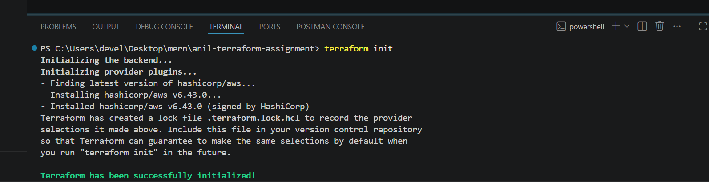
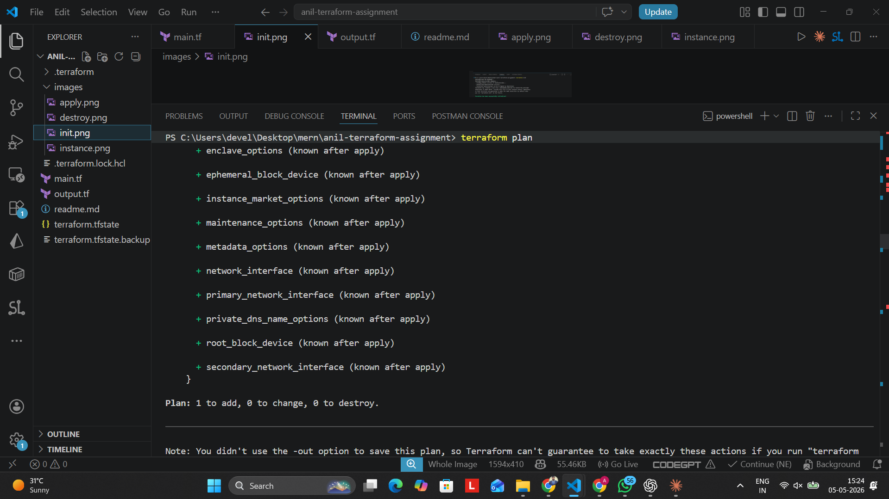
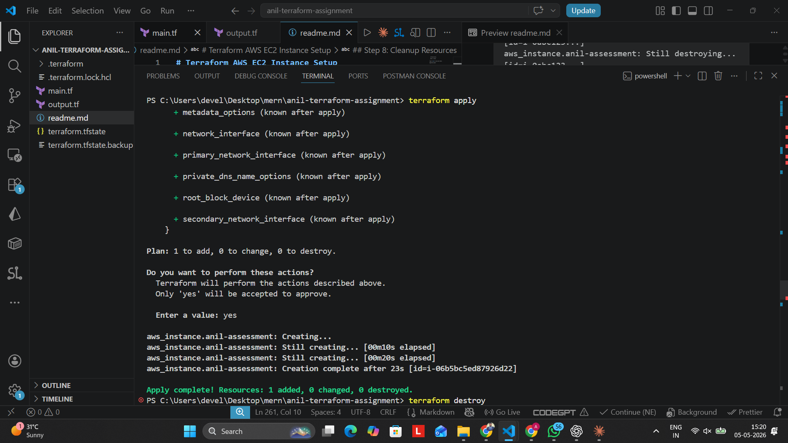
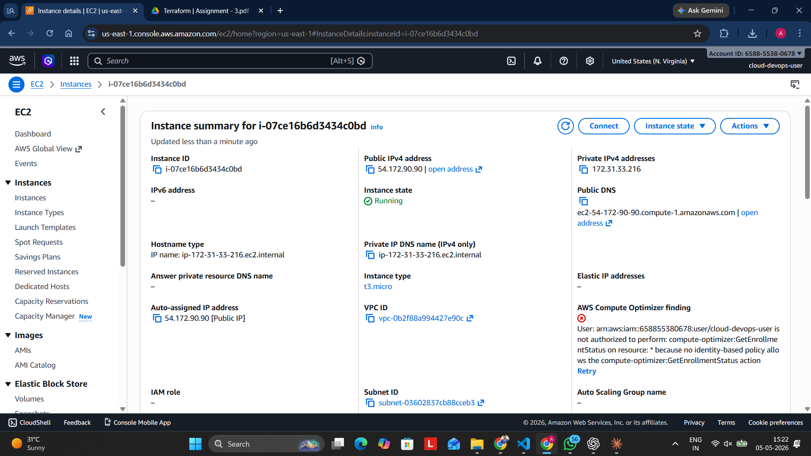
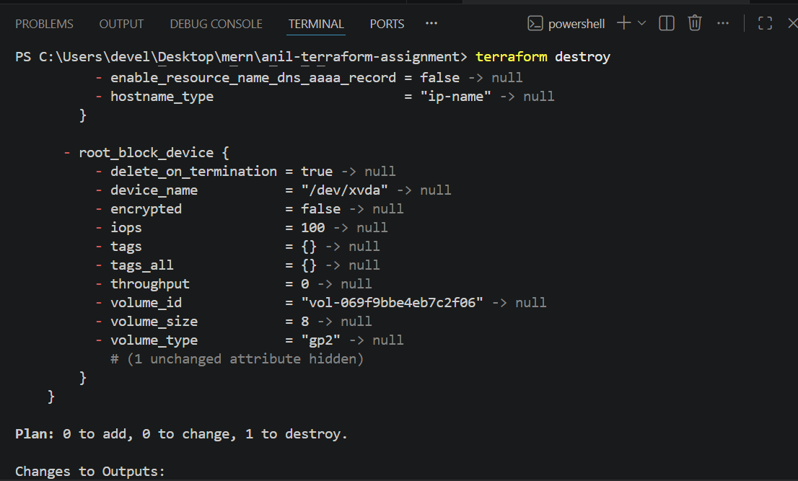

# Terraform AWS EC2 Instance Setup

## Objective
Provision an AWS EC2 instance using Terraform with basic configuration on AWS.

---

## Prerequisites

Before running this project, make sure you have:

- ✅ [Terraform](https://developer.hashicorp.com/terraform/downloads) installed (v1.0+)
- ✅ [AWS CLI](https://aws.amazon.com/cli/) installed (v2.0+)
- ✅ AWS account with active IAM user credentials
- ✅ Basic knowledge of AWS and Terraform concepts

**Verify installations:**

```bash
terraform -v
aws --version
```

Expected output:
```
Terraform v1.x.x
aws-cli/2.x.x
```

---

## Step 1: Configure AWS Credentials

Navigate to your project folder and run:

```bash
cd c:\Users\devel\Desktop\mern\anil-terraform-assignment
aws configure
```

Provide the following information:

| Field | Value |
|---|---|
| AWS Access Key ID | `<your-access-key-id>` |
| AWS Secret Access Key | `<your-secret-access-key>` |
| Default region | `us-east-1` |
| Output format | `json` |

**Verify credentials:**

```bash
aws sts get-caller-identity
```

Expected output:
```json
{
    "UserId": "AIDAI...",
    "Account": "123456789012",
    "Arn": "arn:aws:iam::123456789012:user/your-user"
}
```

---

## Step 2: Initialize Terraform

Initialize your Terraform working directory by downloading required provider plugins:

```bash
terraform init
```

This will create a `.terraform` folder and `terraform.lock.hcl` file.

Expected output:
```
Initializing the backend...
Initializing provider plugins...
Terraform has been successfully configured!
```



---

## Step 3: Review Terraform Configuration

### main.tf

Contains the AWS provider configuration and EC2 instance resource:

```hcl
provider "aws" {
    region = "us-east-1"
    profile = "default"
}

resource "aws_instance" "anil-assessment" {
    ami = "ami-0c94855ba95c71c99"
    instance_type = "t3.micro"
    tags = {
      "name" = "Terraform-Student-Instance"
    }
}
```

**Configuration Details:**
- **Provider**: AWS in `us-east-1` region
- **AMI**: Amazon Machine Image ID (Ubuntu 22.04 LTS)
- **Instance Type**: `t3.micro` (eligible for free tier)
- **Tags**: Named "Terraform-Student-Instance" for easy identification

### output.tf

Outputs the public IP address of the created instance:

```hcl
output "instance_public_ip" {
  value = aws_instance.anil-assessment.public_ip
}
```
---

## Step 4: Plan Terraform Deployment

Validate your configuration and see what will be created:

```bash
terraform plan
```

This command will:
- ✅ Validate Terraform files
- ✅ Show all resources that will be created
- ✅ Highlight any potential issues

Expected output:
```
Terraform will perform the following actions:

  # aws_instance.anil-assessment will be created
  + resource "aws_instance" "anil-assessment" {
      + ami           = "ami-0c94855ba95c71c99"
      + instance_type = "t3.micro"
      + tags          = {
          + "name" = "Terraform-Student-Instance"
        }
    }

Plan: 1 to add, 0 to change, 0 to destroy.
```



---

## Step 5: Apply Terraform Configuration

Deploy the EC2 instance:

```bash
terraform apply
```

You will be prompted to confirm:
```
Do you want to perform these actions?
  Terraform will perform the actions described above.
  Only 'yes' will be accepted to approve.

  Enter a value:
```

Type **`yes`** and press Enter.

Expected output:
```
aws_instance.anil-assessment: Creating...
aws_instance.anil-assessment: Still creating... [10s elapsed]
aws_instance.anil-assessment: Creation complete after 25s

Apply complete! Resources: 1 added, 0 changed, 0 destroyed.

Outputs:

instance_public_ip = "54.242.XXXX.XXXX"
```



---

## Step 6: Verify EC2 Instance

### Option A: Using AWS Console

1. Go to [AWS Console](https://console.aws.amazon.com/)
2. Navigate to **EC2 > Instances**
3. Look for instance named **"Terraform-Student-Instance"**
4. Verify status is **"Running"**



## Step 7: Access the Instance

### Get Instance Details

```bash
terraform output
```

Output:
```
instance_public_ip = "54.242.XXXX.XXXX"
```
---

## Step 8: Cleanup Resources

When you're done, destroy all resources to avoid unnecessary charges:

```bash
terraform destroy
```

You will be prompted:
```
Do you really want to destroy all resources?
  Terraform will destroy all your managed infrastructure.
  
  Enter a value:
```

Type **`yes`** and press Enter.

Expected output:
```
aws_instance.anil-assessment: Destroying... [id=i-0abc123...]
aws_instance.anil-assessment: Still destroying... [id=i-0abc123...]
aws_instance.anil-assessment: Destruction complete after 15s

Destroy complete! Resources: 1 destroyed.
```



---

## Troubleshooting

| Issue | Solution |
|-------|----------|
| `Error: AWS credentials not found` | Run `aws configure` and enter valid credentials |
| `Error: Invalid AMI ID` | Update `ami` in `main.tf` with valid ID for your region |
| `Error: Insufficient capacity` | Try a different instance type or region |
| `Error: Security group not found` | Ensure default security group exists in your VPC |
| `terraform plan` shows no changes | Run `terraform refresh` to sync state |

---
